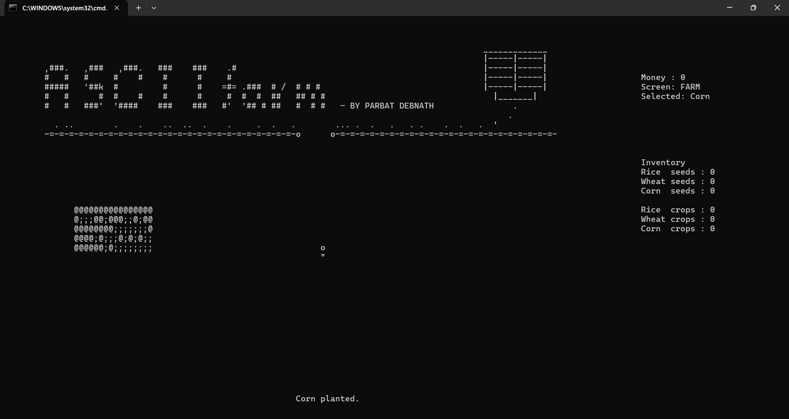

# ASCII farm

A terminal based ascii-style simple farming simulator. Players
can farm and sell crops to the market and gain money.

## Features

**Plant** : Players can plant different seeds in the unoccupied field by selecting specific seed and pressing `P`

**Harvest** : Players can also harvest fully-grown crops from the field.

**Farm** : An ASCII style farm where charecters are crops!
Players can plant seeds and harvest crops once they have fully-grown.

**Shop** : The shop is used to buy seeds of different types of crop and sell harvested crops with in game command.

**Inventory** : A persistent inventory to store all the seeds and crops.

**Money** : Money is what that controls the game. Different crops have different prices as well as seeds.

---

## Screenshots

    
     
    Game Opening Screen

    
     
    Market

    
     
    Gameplay

    
     
    Transactions

---

## Controls

### Farm

| Key | Action            |
| --- | ----------------- |
| W   | Move Up           |
| A   | Move Left         |
| S   | Move Down         |
| D   | Move Right        |
| 1   | Select Rice Seed  |
| 2   | Select Wheat Seed |
| 3   | Select Corn Seed  |
| P   | Plant Crop        |
| H   | Harvest Crop      |
| M   | Go To Market      |
| Q   | Save and Quit     |

### Market

| Key | Action                    |
| --- | ------------------------- |
| C   | Open transaction code bar |
| F   | Return to Farm            |

---

## Download instruction

1. Download the ZIP file from the latest release.
2. Extract the ZIP file.
3. Open the extracted folder.
4. Double-click Play ASCIIFarm.bat.
5. Enjoy the game!

---

## Credits

Hi, I'm Parbat Debnath, preparing myself to contribute in this vast world open-source technologies. I built this as a Coding challenge and making it was really fun.

---

## Contacts

[Parbat Debnath](https://github.com/parbat-debnath)

[LinkedIn](https://www.linkedin.com/in/parbat-debnath-b9261a365)
